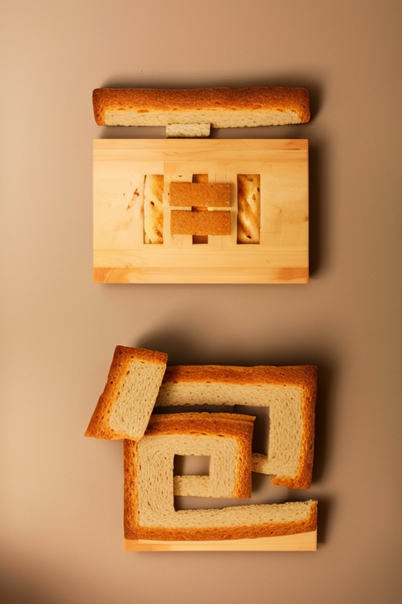

# Stable Diffusion 文字酷炫新玩法，艺术，光影字体生成教程

## 项目目录

1. [前期准备](#ready_start)
	1. [文字底图](#ready_font)
	2. [大模型](#ready_large_model)
	3. [控制模型](#ready_model)
2. [控制综述](#admin_desc)
	1. [简明步骤](#admin_step)
    2. [控制逻辑](#admin_logic)
3. [艺术文字](#art_word)
    1. [面包](#word_bread)
    2. [奶油](#word_cream)
    3. [蛋糕](#word_cake)
    4. [雨水](#word_rain)
4. [嵌入文字]()
    1. [春天]()
5. [光影文字]()
    1. [数字/字符]()
    2. [牛逼/晚安]()
    3. [大本营]()
6. [扩展内容]()
    1. [符号/建筑设计]()
    2. [产品设计]()
    3. [图生图: 图片+文字融合]()
7. [实现]()
8. [FAQ问题]()
    1. [文字过于明显]()
    2. [字体不好看]()
    3. [看不到文字]()
    4. [文字挤到一起]()
    5. [光影文字不美观]()
    6. [提示词怎么写]()
9. [相关链接](#about_links)
10. [参考]()

### 1. 前期准备

#### 1.1 文字底图

工具推荐 美图秀秀 或者 Photoshop

1. 创建 **"白底黑字的文字图，根据情况使用invert进行反色处理."**
2. 分辨率设置建议 512*768 (同生成图比例一致)
3. 保存为PNG文件

#### 1.2 大模型

真实系大模型即可，没有特别需求。

推荐 revAnimated, deliberate, majicmixRealistic

不同大模型生成效果有差别，建议 **控制变量** 后多对比测试。

#### 1.4 控制模型

本文中用到第三方控制模型需要手动下载

##### Brightness 亮度控制

[下载地址](https://huggingface.co/ViscoseBean/control_v1p_sd15_brightness/tree/main)
 
##### Controlnet QR Code Monster v1 For SD-1.5 

[下载地址](https://huggingface.co/monster-labs/control_v1p_sd15_qrcode_monster)

### 2. 控制综述

#### 2.1 简明步骤

1. 安装 Stable Diffusion 和 ControlNet。
2. 在Stable Diffusion 中进行文生图+ControlNet 或者 图生图+ControlNet，图生图更简单。
3. 重点调整控制权重和控制起始时机。

#### 2.2 控制逻辑

所有模型和参数仅供参考，可以继续优化！

本文主要介绍基本实现方法，想更加美观建议在控制变量的同时微调参数和提示词。

1. 推荐预处理器： invert (白底黑线反色）+ Depth/Tile/Canny/Lineart/Softedge/Scribble的搭配。
2. 想文字更显眼就加大控制权重。
3. 想画面更美丽就减小控制权重。
4. 引导介入时机越早，对画面破坏程度越高，画面越不美观。
5. 引导结束时机越大，留给模型融合图片的时间就越少，文字融合度效果变差。
6. 白底反色预处理器可以最大程度保留字体，其他预处理器会给画面增加更多元素，导致文字不容易识别。
7. 字体粗细不同会影响预览图和最终结果，为了字体更明显建议粗体字。
8. 场景上融合的字体可以大一些，人物上融合的字体建议小一些，光线打到人物脸上不美观，可以调整底图文字位置。

### 3. 艺术文字

#### 3.1 面包

效果A | 效果B
:---: | :---:
 | 

描述 | 案例
:---: | :---
正向提示词 | bread lay on wood kitchen table
备选提示词 | bread,Air pockets in the dough,Realistic texture,Golden brown crust,soft and fluffy
反向提示词 | human,person,girl,boy,(worst quality:2), (low quality:2), (normal quality:2), lowres, monochrome, grayscale, watermark

**注意：如果觉得背景复杂影响构图，加入simple background 或者 white background 之类提示词即可。**

步数和采样方法仅供参考，可以更换。

使用Depth模型，反色和midas处理底图，实现不一样效果。

效果A | 效果B

更多参数与效果图参考下面图表：

ID | 大模型 | 预处理器 | 控制模型 | 
原图
 | 
预处理
-预览图 | 
生成图1
 | 
生成图2
 | 
生成图3
 | 
生成图4
 
:---: | :---: | :---: | :---: | :---: | :---: | :---: | :---: | :---: | :---: 
1 | deliberate_v2 | invert (白底黑线反色其他默认) | depth 默认配置 |  | bread lay on wood kitchen table | bread lay on wood kitchen table | bread lay on wood kitchen table | bread lay on wood kitchen table | bread lay on wood kitchen table
2 | deliberate_v2 | depth_midas 其他默认 | depth 默认配置 |  | bread lay on wood kitchen table | bread lay on wood kitchen table | bread lay on wood kitchen table | bread lay on wood kitchen table | bread lay on wood kitchen table
3 | revAnimated_v122 | depth_midas 其他默认 | depth 默认配置 |  |  (Best quality,masterpiece,ultra high res,raw photo,official art), bread |  (Best quality,masterpiece,ultra high res,raw photo,official art), bread |  (Best quality,masterpiece,ultra high res,raw photo,official art), bread |  (Best quality,masterpiece,ultra high res,raw photo,official art), bread |  (Best quality,masterpiece,ultra high res,raw photo,official art), bread
4 | deliberate_v2 | Canny 其他默认 | Canny 默认配置 |  |  (Best quality,masterpiece,ultra high res,raw photo,official art), bread |  (Best quality,masterpiece,ultra high res,raw photo,official art), bread |  (Best quality,masterpiece,ultra high res,raw photo,official art), bread |  (Best quality,masterpiece,ultra high res,raw photo,official art), bread |  (Best quality,masterpiece,ultra high res,raw photo,official art), bread
5 | deliberate_v2 | Canny invert 白底黑线反色其他默认 | Canny 默认配置 |  |  bread lay on wood kitchen table |  bread lay on wood kitchen table |  bread lay on wood kitchen table |  bread lay on wood kitchen table |  bread lay on wood kitchen table
6 | deliberate_v2 | lineart standard (标准线稿提取-白底黑线反色) | Lineart 默认配置 |  |  (Best quality,masterpiece,ultra high res,raw photo,official art), bread |  (Best quality,masterpiece,ultra high res,raw photo,official art), bread |  (Best quality,masterpiece,ultra high res,raw photo,official art), bread |  (Best quality,masterpiece,ultra high res,raw photo,official art), bread |  (Best quality,masterpiece,ultra high res,raw photo,official art), bread
7 | deliberate_v2 | lineart (白底黑线反色) | Lineart 默认配置 |  |  bread lay on wood kitchen table |  bread lay on wood kitchen table |  bread lay on wood kitchen table |  bread lay on wood kitchen table |  bread lay on wood kitchen table
8 | deliberate_v2 | lineart (白底黑线反色) | Lineart 默认配置 |  |  make it bread |  make it bread |  make it bread |  make it bread |  make it bread
9 | deliberate_v2 | None | IP2P 引导终止时机0.8 + Canny 权重0.5 介入0.3 终止0.8|  |  make it bread |  make it bread |  make it bread |  make it bread |  make it bread

#### 3.2 面包

效果A | 效果B
:---: | :---:
 | 

### 相关链接

[2023 年人工智能 AIGC 学习手册](https://ks48jupoux.feishu.cn/docx/J85pdGX5josTuwx5AVxc6LHJnVc)  
